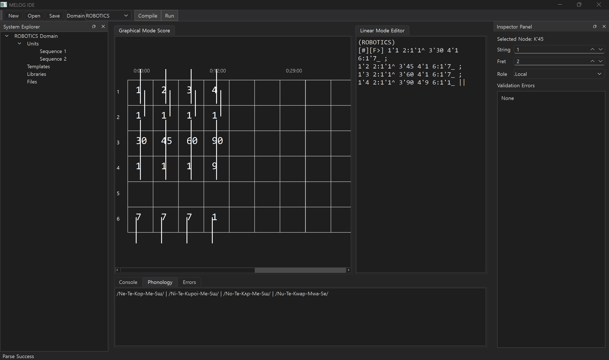

# MELOG (Musical Engineering LOgic Graph)

**MELOG**는 타브 악보(TAB)의 6선 시스템을 데이터 카테고리로, 프렛 번호(Fret)를 논리적 상태로 치환하고, 정간보(Jeongganbo)의 격자를 절대 시간축으로 치환하여 세상을 좌표화하는 음악 기반 공학 데이터 언어입니다.

---

## 📑 목차 (Table of Contents)

1. [철학 및 목적](#1-철학-및-목적)
2. [체계 및 기호 정의](#2-체계-및-기호-정의)
3. [형태론 및 발음 체계](#3-형태론-및-발음-체계)
4. [구문론](#4-구문론)
5. [고급 제어 로직](#5-고급-제어-로직)
6. [Example: $DOMAIN ROBOTICS](#example-domain-robotics)
7. [English Documentation](#english-documentation)

---

## 1. 철학 및 목적 (Philosophy and Purpose)

* **언어 유형:** 논리적 엄밀함(Logical Rigor)과 실험적 정보 압축(Experimental Information Compression)을 동시에 지향하는 공학어.
* **핵심 목적:** 연구 및 학술 데이터 전달 시 비모호성 극대화 및 정보 압축.

### 기본 원칙 (Guiding Principles)

* **[제1원칙]** 모든 기호 단위(symbolic unit)는 TAB 프레임워크 내부의 명시적 구조 좌표에 고정되며, 모든 관계는 음악적 기호를 통해 계산된다.
* **[제2원칙]** 텍스트형(Linear Mode)은 사고의 기록을 위한 것이고, 악보형(Graphical Mode)은 통찰의 공유를 위한 것이다.
* **[제3원칙]** 모든 숫자는 해당 도메인의 정의에 따라 '프렛' 또는 '수치'로 자동적으로 해석된다.

## 🌐 잠재적 활용 분야 (Potential Applications)

MELOG는 고도의 정밀도와 높은 정보 밀도가 필요한 분야를 위한 강력한 데이터 인터페이스로 활용될 수 있습니다.

* **로보틱스:** 복잡한 다축 관절의 상태 좌표 및 정밀 제어 시퀀스 기록.
* **자율주행 및 항공우주:** 초고속 센서 데이터 스트림을 시각적 악보 형태로 압축 및 모니터링.
* **퀀트(금융):** 다변수 금융 파생상품의 상관관계를 리듬과 화성 구조로 분석.
* **국방 및 보안:** 비정형 데이터의 암호화 전송 및 실시간 전술 상황의 도식화.
* **의료 공학:** 생체 신호(EEG, ECG)를 논리 상태값으로 변환하여 진단 보조.

---

## 2. 체계 및 기호 정의 (System and Symbol Definitions)

### 2.1 악보형 (Graphical Mode)

악보형(Graphical Mode)은 데이터의 시각적 공간성과 동시성을 표현하는 시스템 로그 시트입니다.

* **X축 (정간보 격자):** 절대 시간 클럭(Absolute Time Clock). 모든 칸은 물리적으로 동일한 가로 길이를 가지며, 이는 고정된 시간 단위를 의미한다. 한 칸 안의 좌표들은 병렬 처리된다. 각 격자 셀은 활성 도메인 또는 시스템 구성에 의해 정의되는 고정 시간 해상도(Δt)를 나타낸다. 동일한 셀 내부에서 발생한 모든 이벤트는 명시적으로 벡터 연결되지 않는 한 시간적으로 병렬인 것으로 처리된다.
* **Y축 (6선 TAB):** 데이터 도메인. 1번 줄부터 6번 줄까지 고정된 데이터 카테고리를 담당한다.
* **데이터 노드 (Rhythmic Number):** 격자 내 숫자는 상태(프렛)를 의미하며, 기둥(Stem)은 데이터 흐름을 제어한다.

  * **상향 기둥 (Up-stem):** 출력 (Transmission)
  * **하향 기둥 (Down-stem):** 입력 (Reception)
  * **관통 기둥 (Through-stem):** 중계 및 실시간 처리
* **기둥의 질감 (Stem Texture):**

  * **직선:** 확정 데이터 (Confirmed)
  * **점선:** 추정 데이터 (Estimated)
  * **지그재그:** 노이즈 또는 불안정 데이터 (Noise / Unstable)
* **기호 연산 (Symbolic Operations):**

  * **이음줄 (Tie):** 이전 프레임의 상태값이 변화 없이 유지된다. (Latching)
  * **슬러 (Slur):** 여러 좌표/프레임을 하나의 논리 그룹(logical group)으로 묶는다. (Smooth Interpolation / Vectoring Trigger)
  * **셈여림 (f, p):** 데이터 신뢰도 및 샘플링 우선순위 ($f$: 강한 상관관계, $p$: 약한 변수).
  * **비브라토 (~~~):** 허용 오차(Tolerance) 범위 내 진동.

### 2.2 텍스트형 (Linear Mode)

텍스트형(Linear Mode)은 악보 좌표를 문자열로 변환하며, AI 및 데이터 통신에 최적화되어 있습니다.

* **좌표 표기:** `줄'프렛` (예시: `2'1`)
* **플럭스 연산자 (Flux Operators):**

  * **벡터(/):** 연속적인 전환 (Slur).
  * **펄스(,):** 불연속적인 도약.
* **입출력 표시:** `^` (출력/능동), `_` (입력/수동), `|` (중계/실시간 처리)
* **단어 생성:** `자음(줄 번호) + 모음(프렛 번호)` (예: `NE`)
* **다자릿수 표기:** 다자릿수 값은 줄 번호 뒤에 연속 표기할 수 있으며, 해석 방식은 활성 도메인의 규칙과 primitive/composite state 정의에 따라 결정된다.
* **단위 선언 (Unit Declaration):** 3번 줄의 기본 단위는 도메인 선언 시 대괄호 `[]`를 사용하여 지정한다. 문장 내부에서 단위를 변경할 경우, 표준 영문 소문자 약어를 값 뒤에 직접 부착한다.

#### 2.2.1 계층적 표기 (Hierarchical Notation)

* **싱글 틱 ('):** 논리 상태(프렛 번호)를 호출할 때 사용.
* **콜론 (:):** 고유 ID(관절 번호, 센서 번호) 지정.
* **콤마 (,):** 동일 도메인 내 여러 ID를 집합적으로 지정.
* **복합 표기:** ID와 상태를 동시에 지정할 경우 `줄:ID'상태` 형식 사용.

#### Structural Binding Rule

콜론(`:`)은 ID 연결 또는 scoped assignment와 같은 구조적 바인딩 및 계층 지정에 우선적으로 사용된다.
의미 연산 및 논리 변환은 가능하면 별도의 논리 연산자를 사용하는 것이 권장된다.

텍스트형(Linear Mode)은 악보형(Graphical Mode)과 의미적으로 동등하지만, 반드시 시각적으로 완전 손실 없이 대응되는 것은 아니다.
공간적 그룹화, 기둥 기하(stem geometry), 시각적 레이어링 등의 일부 그래픽 속성은 구현 방식에 따라 달라질 수 있다.

---

## 3. 형태론 및 발음 체계 (Morphology and Phonology)

### 줄 번호 (자음) - 데이터 카테고리

| 줄 번호 | 카테고리          | 자음    | 한국어 음가 |
| :--- | :------------ | :---- | :----- |
| 1    | 시간 / 순서 / 빈도  | **N** | ㄴ      |
| 2    | 주체 / 대상 / 변수  | **T** | ㄷ      |
| 3    | 수치 / 양 / 범위   | **K** | ㄱ      |
| 4    | 상태 / 속성 / 성질  | **M** | ㅁ      |
| 5    | 관계 / 논리 / 연산  | **L** | ㄹ      |
| 6    | 환경 / 배경 / 도메인 | **S** | ㅅ      |

### 프렛 번호 (모음) - 논리적 상태

| 프렛 | 의미           | 발음         |
| :- | :----------- | :--------- |
| 0  | 중립 / 기점      | **a** (아)  |
| 1  | 긍정 / 내부 / 전진 | **e** (에)  |
| 2  | 부정 / 외부 / 후퇴 | **i** (이)  |
| 3  | 반복 / 집합 / 다수 | **o** (오)  |
| 4  | 심화 / 하단 / 고착 | **u** (우)  |
| 5  | 확장 / 상단 / 변형 | **oi** (외) |
| 6  | 이면 / 보조 / 대기 | **ʌ** (어)  |
| 7  | 수평 / 평형 / 보류 | **ɯ** (으)  |
| 8  | 초점 / 강조 / 특수 | **y** (위)  |
| 9  | 복합 / 완성 / 전체 | **wa** (와) |

---

## 4. 구문론 (Syntax)

### 4.0 도메인 선언 (Domain Declaration)

모든 데이터 패킷 또는 문장 그룹이 시작되기 전에 도메인을 최우선 순위로 선언해야 한다.

1. **전역 선언 (Global Declaration):**

   * **텍스트형:** 파일/스트림 최상단에 `$DOMAIN` 기입. 세션 종료(`||`)까지 유효.
   * **악보형:** 첫 페이지 좌측 상단에 명시.
2. **지역 선언 (Local Override):**

   * **텍스트형:** `[조표]` 직전에 `(DOMAIN)` 표기. 문장 종료(`||`)까지 유효.
   * **악보형:** 특정 마디(격자) 상단에 소괄호로 표기.

### 4.1 문장 구조

* **텍스트형:** `(지역 도메인) [조표][자리표][시간/배경][주체^][동작][대상_][결론] ||`

### 4.2 주요 선언자 및 격 표지

* **G> (High Clef):** 상태 선언 (정적 관찰 데이터).
* **F> (Low Clef):** 동작 선언 (동적 에너지 흐름).
* **^ / _ :** 주격(행위자) / 목적격(대상).
* **|| (Double Barline):** 문장 종료.

### 4.3 논리 및 관계 연산자

* `+` / `-` : 증가 / 감소
* `!` / `*` : 부정(중단) / 강조(임계점)
* `?` : 의문/미정 (`??`: 진동 오차, `~?`: 추정값)
* `~` : 연결 / 소속
* `&` : 동시 발생 / 선택적 병렬
* `->` : 인과 관계 (악보의 슬러에 대응)
* `>>` / `<<` : 크레센도(가속) / 데크레센도(감속)
* `/` : 연속 벡터 / 전이

### 4.4 정밀 제어 표기

* `\` : **미세 보정** (micro-error correction에 사용)
* `.` : **단일 펄스 실행** (불연속 데이터 펄스 실행)

### 4.4.1 연산자 결합 우선순위 (Operator Binding Priority)

도메인별 규칙에 의해 명시적으로 그룹화되지 않는 한, 연산자는 아래 우선순위를 따른다. 동일 우선순위 내에서는 좌측부터 우측 순으로 평가된다.

1. `! * ?`
2. `/`
3. `->`
4. `&`
5. `+ -`

`?`는 명시적 그룹화가 없는 한 바로 앞의 기호 단위에 결합된다.

도메인 구현은 명시적으로 선언된 경우에 한해 우선순위를 재정의할 수 있다.

### 4.5 수치 표현 및 자릿수 마커 (Numerical Expression & Digit Markers)

긴 숫자 압축을 위해 다음 기호를 사용한다:

* **P** (받침 -p): $10^1$
* **V** (받침 -v): $10^2$
* **B** (받침 -b): $10^3$
* **r** (re): 소수점 (`.`)
* **규칙:** 분해는 항상 가장 높은 자릿수 마커(B > V > P)부터 시작해야 한다.

### 4.6 수치 분해 규칙

1. 천 단위(`B`)가 존재하면 `B`를 기준으로 분해한다.
2. 천 단위 미만에서는 백 단위(`V`)를 우선적으로 사용한다.

### 4.7 해석 우선순위 (Interpretation Priority)

| 줄 번호    | 기본 해석 원칙      |
| :------ | :------------ |
| 1, 4, 5 | 프렛 우선 해석      |
| 2, 6    | ID 우선 해석      |
| 3       | 항상 물리적 수치로 해석 |

3번 줄은 수치 분해 의미론을 우선적으로 사용하며, 다른 줄은 도메인에서 별도 정의하지 않는 한 논리 프렛 해석을 우선한다.

#### Primitive and Composite State Rule

0부터 9까지의 프렛은 primitive atomic logical states로 취급된다.

9를 초과하는 값은 다음 중 하나로 해석된다:

1. Numeric values
2. Composite state structures

단, 도메인 명세에서 명시적으로 재정의된 경우는 예외로 한다.
복합 상태는 primitive fret inventory를 확장하기보다는 relational composition을 통해 표현하는 것이 권장된다.

### 4.8 ID 지정을 위한 발음 확장

2번 줄(T) 또는 6번 줄(S)에서 특정 대상을 지정할 때의 발음 규칙:

* **규칙:** `줄 자음 + ID 프렛 모음 + 상태 프렛 모음`

### 4.9 데이터 연속성 로직 (Data Continuity Logic)

MELOG는 노드 연결 방식에 따라 실시간 데이터 변화를 처리한다.

1. **양자화 도약 (Quantized Jump):** 커넥터 없이 노드를 배치한다. 전이는 클럭 에지에서 즉시 발생한다.
2. **연속 벡터 (Continuous Vector):** 노드를 슬러(악보형) 또는 `/`(텍스트형)로 연결한다. 시스템이 값 사이를 부드럽게 램프 보간한다.
3. **정적 지속 (Static Persistence):** 노드를 이음줄(Tie)로 연결한다. 값이 래치(latch)되어 유지되며, 이음줄 종료 전까지 새로운 샘플링 트리거를 무시한다.

---

## 5. 고급 제어 로직 (Advanced Control Logic)

### 5.1 조표 (Key Signature)

* **Sharp (#):** 시스템 활성화 및 가중치 증가 모드.
* **Flat (b):** 시스템 대기 및 보수적/감소 모드.
* **Natural (♮):** 이전 문맥 변수 전체 초기화.

### 5.2 화성 충돌 (Harmonic Collision)

동일 격자 내부의 충돌 데이터(예: `+`와 `-`의 동시 발생)는 **불협화음(Dissonance)** 으로 정의된다.
시스템은 이를 오류로 감지하거나 사전 정의된 우선순위에 따라 상쇄 연산을 수행한다.

---

## Example: $DOMAIN ROBOTICS

### 로보틱스에서의 줄 카테고리 (String Categories in Robotics)

| 줄 번호 | 자음    | 원래 카테고리 | 로보틱스에서의 의미     |
| :--- | :---- | :------ | :------------- |
| 1    | **N** | 시간 / 순서 | 시퀀스 및 속도       |
| 2    | **T** | 주체 / 변수 | 제어 대상 관절 / 파츠  |
| 3    | **K** | 수치 / 범위 | 목표 값 (각도 / 거리) |
| 4    | **M** | 상태 / 속성 | 모터 상태          |
| 5    | **L** | 관계 / 논리 | 동작 간 논리        |
| 6    | **S** | 환경      | 센서 및 안전 피드백    |

### 로보틱스에서의 프렛 정의 (Fret Definitions in Robotics)

| 프렛 | 발음     | 일반 의미   | 로보틱스에서의 의미    |
| :- | :----- | :------ | :------------ |
| 0  | **a**  | 중립      | 대기 / 정지       |
| 1  | **e**  | 긍정 / 내부 | 정방향 회전 / ON   |
| 2  | **i**  | 부정 / 외부 | 역방향 회전 / OFF  |
| 3  | **o**  | 반복 / 다수 | 고속 동작 모드      |
| 4  | **u**  | 심화 / 고착 | 토크 제한 / 충돌 경고 |
| 5  | **oi** | 확장 / 변형 | 궤적 오프셋 및 보정   |
| 6  | **ʌ**  | 이면 / 보조 | 보조 파츠 작동      |
| 7  | **ɯ**  | 수평 / 보류 | 균형 유지 / 위치 고정 |
| 8  | **y**  | 초점 / 특수 | 정밀 제어         |
| 9  | **wa** | 완성 / 전체 | 시퀀스 종료 및 완료   |

---

## English Documentation

영문 규격서는 아래 링크에서 확인할 수 있습니다.

* [English Specification (README.md)](./README.md)

## 🛠 기술 스택 및 개발 로드맵 (Tech Stack & Development Roadmap)

MELOG 전용 IDE 구축을 통해 데이터 좌표화 과정을 간소화하는 것을 목표로 하고 있습니다.

* **언어:** Python 3.x
* **프레임워크:** `PyQt6` (현재 학습 및 프로토타이핑 단계)
* **핵심 목표:**

  * 6선 TAB 기반 데이터 입력 인터페이스 구현.
  * 텍스트형(Linear Mode)과 악보형(Graphical Mode) 간의 실시간 렌더링.
  * 도메인별 사전(Dictionary) 자동 완성 기능.

> **Developer's Note:** 개발자는 일반적인 Python 프로그래밍에는 익숙하지만, 현재 이 프로젝트를 위해 `PyQt`를 학습 중입니다. GUI 아키텍처 또는 PyQt 모범 사례(best practices)에 대한 제안은 언제든 환영하며 감사히 받겠습니다.
